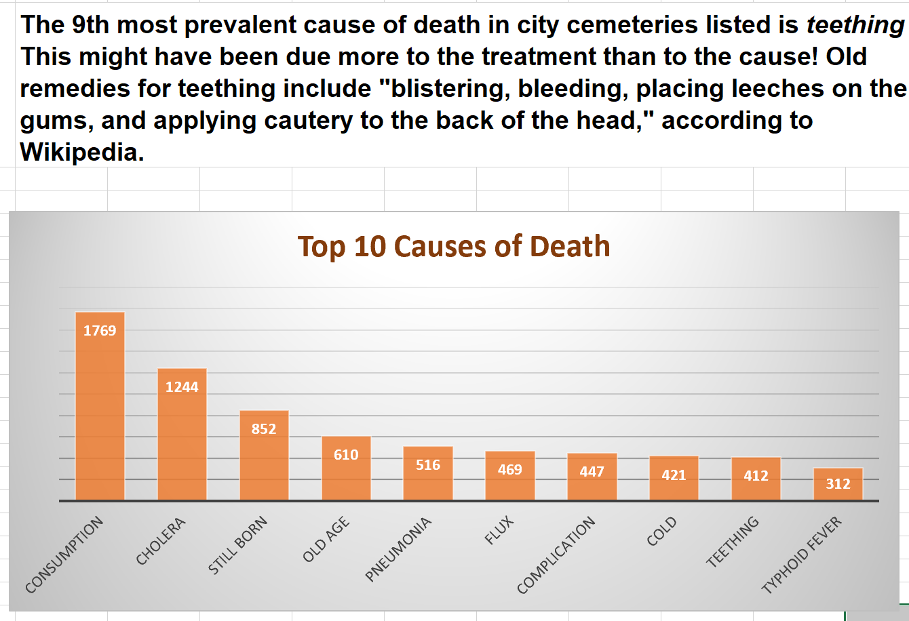

## Introduction

The Nashville City Cemetery Association has asked you to create marketing materials. The following exercises are a _starting point_ for exploring the data and creating visualizations. Once you have completed the exercises below, create additional visualizations to accompany storytelling points. An example of this is shown below for the first exercise.

The city of Nashville provides a dataset of known burials in city cemeteries from 1846 through 1979. This dataset holds factual information, but it also offers a fascinating glimpse into historical trends in medicine, literacy, racial equality, and more.

#### Created new sheets for each pivot table or analysis work done to create a visualization. Final product is a marketing suggestion for the Nashville City Cemetery to increase attendance, awareness, and interest. 

![Final_Product](assests/Nash_Cemetery.PNG
